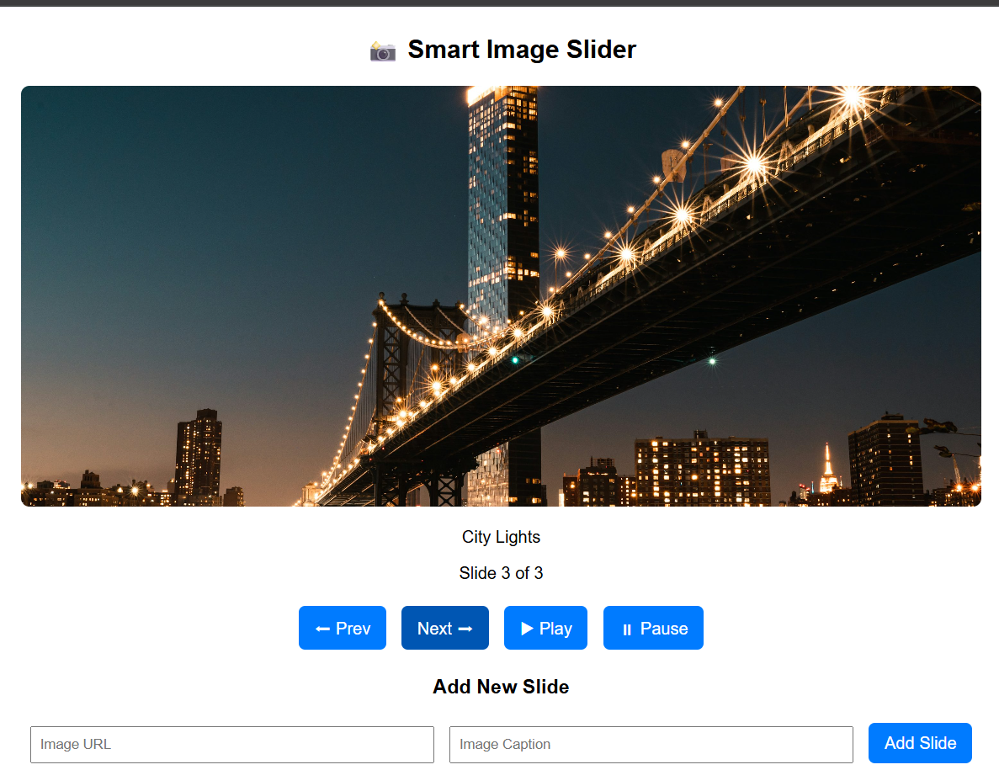

# 🖼️ Smart Image Slider

## 📌 Project Overview
Smart Image Slider is a JavaScript-based mini project that allows users to navigate through images one by one using **Next** and **Prev** buttons.  
The project demonstrates the use of **arrays, objects, loops, conditionals, and ES6 features** in JavaScript.

---

## 🚀 Features
- 🔄 **Next/Prev navigation** with boundary messages  
- ▶️ **Auto-play** with pause/resume  
- ➕ **Add new images dynamically**  
- 🔢 **Slide counter** (e.g., *Slide 2 of 5*)  
- ✨ Clean design with **HTML + CSS**  
- ⚡ Uses **ES6 features** (`let`, `const`, arrow functions, template literals)

---

## 📷 Output Screenshots

### 🖼️ Home Page

### ▶️ Next Slide Example

### ⏩ Auto-Play Mode

---

## 🧩 Tech Stack
- **HTML5** for structure  
- **CSS3** for styling  
- **JavaScript (ES6)** for logic  

---

## 📝 How to Run
1. Clone or download this repository  
2. Open the project folder  
3. Launch `index.html` in your browser  
4. Enjoy the working image slider 🎉  

---
